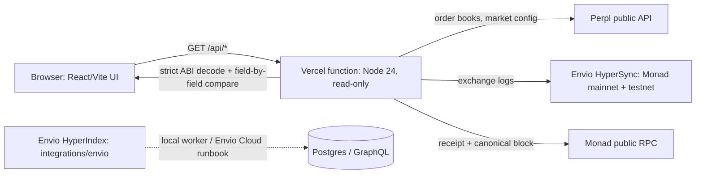

# Exit Evidence Workbench

**Check a Monad exchange event against the chain before you trust it.** Exit Evidence Workbench puts live Perpl order books, Envio-indexed exchange activity and an independent receipt check in one read-only page, so integrators can tell a quote, an order request and a real fill apart.

Built for **Monad Metropolis** (Best Use of Envio). Read-only: no wallet, no signing, no trading.

## Demo and links

| What | Link |
| --- | --- |
| Live app (Monad mainnet + testnet) | https://monad-exit-evidence.vercel.app |
| Health check | https://monad-exit-evidence.vercel.app/api/health |
| Live Envio activity (JSON) | [mainnet](https://monad-exit-evidence.vercel.app/api/activity?network=mainnet) · [testnet](https://monad-exit-evidence.vercel.app/api/activity?network=testnet) |
| Technical demo video (≤3 min) | _add the public YouTube link here_ |
| Pitch video (≤2 min) | _add the public YouTube link here_ |
| Envio Cloud HyperIndex endpoint | _not deployed yet, see [Envio Cloud runbook](docs/envio-cloud-deployment.md)_ |
| Submission text | [docs/submission-text.md](docs/submission-text.md) |

## What it does

1. **Market:** pick Monad mainnet or testnet and read the current public Perpl market configuration and order book. Enter a quantity yourself to see quoted depth for that size (quote analysis only, never a fill).
2. **Activity:** see recent Perpl Exchange events (order requests, maker/taker fills, position closes and decreases) read through **Envio HyperSync**, with the exact block window covered.
3. **Evidence:** pick any event and the server independently fetches its transaction receipt and canonical block from Monad RPC, decodes the log with the official Perpl ABI, and compares every field against the Envio record (`INDEX_AND_CHAIN_MATCH` or a precise mismatch).
4. **Export:** download the exact observation as JSON with source timestamps, a change-detection digest and its limits.

If a source is down or stale, the app says "unavailable". It never falls back to sample data.

## How Envio is used

- **HyperSync (live in production):** `src/data/envio-hypersync.ts` queries `monad.hypersync.xyz` and `monad-testnet.hypersync.xyz` for the Perpl Exchange contract logs, normalizes them with the same ABI decoder as the indexer, caches within strict freshness limits, and powers both the activity feed and historical lookups for the receipt check.
- **HyperIndex (indexer in this repo):** `integrations/envio/` has `config.yaml`, `schema.graphql` and `src/EventHandlers.ts` for 8 Exchange events on both chains. It ran as a local worker during development; `config.cloud.yaml` and the [Envio Cloud runbook](docs/envio-cloud-deployment.md) cover hosting it.

## Architecture



## Quick start

Needs Node 24 (Node 22 also passes the backend tests).

```sh
cp .env.example .env          # set ENVIO_API_TOKEN (free at https://envio.dev/app/api-tokens) and ENVIO_DATA_SOURCE=hypersync
npm ci && npm --prefix web ci
npm --prefix web run build
npm start                     # http://127.0.0.1:4100
npm test && npm run typecheck # 123 backend tests
```

The production deployment is Vercel (`vercel.json`), with `ENVIO_DATA_SOURCE=hypersync` and `ENVIO_API_TOKEN` set as server-side environment variables.

## Hackathon disclosures

- **Build window:** this repository was created on 1 October 2026, inside the Metropolis build window (1 September to 13 October 2026), and its full commit history is public. _Author: confirm here whether any code was written before 1 September 2026; if so, list it as pre-existing._
- **Third-party code and data:** Perpl Exchange ABI from the [PerplFoundation dex-sdk](https://github.com/PerplFoundation/dex-sdk) and [API docs](https://github.com/PerplFoundation/api-docs); Envio HyperIndex/HyperSync; viem; React/Vite; embedded-postgres for the local worker. Versions are pinned in the lockfiles.
- **AI coding tools:** AI coding assistants were used to write and test much of this code under the author's direction, and Claude Sonnet was used for written code and evidence reviews (see the dated records in `docs/`). _Author: name every AI tool you used here._
- **Narration:** the demo videos use synthetic Deepgram voice narration.
- **License:** MIT (see `LICENSE`).

## Detailed notes

A read-only Monad workbench for actual Perpl market data, Envio exchange activity when a fresh genuine source is available, and independently decoded public transaction evidence.

### Real integration behavior

- Public Perpl market configuration and order-book quotes on Monad mainnet and testnet, with actual source URLs, precision, timestamps and stale/error states.
- Optional depth calculations for a quantity entered by the user, computed from current public quotes. No position, wallet balance or order outcome is assumed.
- Deployed Envio HyperSync reads query official Monad sources directly with complete bounded block coverage and normalized event provenance. The retained optional HyperIndex path uses PostgreSQL and atomic committed-progress exports. Stale or missing activity is unavailable, with no inferred events.
- A public transaction inspector independently fetches network ID, transaction receipt and canonical block, strictly decodes a supported Perpl Exchange log, and compares the complete normalized event with the fresh Envio page. Block hashes, timestamps and every decoded parameter are included in the comparison.
- Exact observation JSON exports with a change-detection digest and explicit provenance limitations.

The production app has **no simulated execution controls, sample positions, prefilled transaction, generated fills or fixture data fallback**. Legacy rehearsal and receipt-verification routes return HTTP 410. Historical rehearsal generators live only in `tests/legacy` for offline regression history; the runtime does not import or serve their generated outcomes. Unit test inputs are not integration evidence. Selected workbench and HTTP/RPC integration tests, plus browser smoke, use real provider reads. Parser, state, route, timeout and failure-handling regressions use explicitly offline test inputs; those inputs are never served by the app or presented as integration evidence.

Public events describe their participants, not the viewer or an execution performed by this app. An OrderRequest event is a request, not a fill. Canonical-block checks are point-in-time provider observations, not finality guarantees. A digest does not authenticate an owner. This app has no wallet, signing, trading or payment path.

### Run

Use Node 24.x (the `.nvmrc` and `.node-version` files select that major):

```sh
npm ci
npm --prefix web ci
npm --prefix web run build
npm start
```

Open http://127.0.0.1:4100. The server binds loopback. Live provider reads require network access; unavailable reads stay unavailable.

For indexed activity, follow [Envio setup](integrations/envio/README.md). Resume the existing window with `npm --prefix integrations/envio run start:recent`. To deliberately start a distinct recent window, use `npm --prefix integrations/envio run start:recent -- --window oct04-live`. Run only one supervisor at a time. Each named window records real RPC heads/start blocks and uses its own persisted database/schema; it does not reset previous checkpoints. Restarting the same name resumes that window. Foreground processes are temporary, not permanently hosted services.

The deployed [on-demand HyperSync mode](docs/mac-independent-hypersync.md), selected by `ENVIO_DATA_SOURCE=hypersync`, reads directly from Envio. October 7 authenticated reads and independent client RPC comparisons passed on both networks after this project's Mac services stopped; the strict historical-target checks also passed sequentially with a one-minute gap. The default for an unconfigured local checkout remains `hyperindex`, using the SQL/bridge pipeline. The [October 7 validation](docs/publication-validation-2026-10-07.md) records exact scope, source times, failed attempts followed by spaced recovery, and remaining submission steps; these checks do not guarantee uptime.

Prepared HyperSync previews use approximately eight provider calls per minute for steady one-page refreshes across both networks in a warm instance. Original-time cache expiry and a shared per-instance request guard bound local usage; they do not enforce the provider's token-wide, cross-chain unit budget or guarantee availability across serverless instances. Authenticated reads passed; normal free quota behavior after the initial token boost remains unverified. See the mode documentation for measured scope and limits.

### Verify

```sh
npm test
npm run typecheck
npm --prefix web test
npm --prefix web run build
npm --prefix web run format:check
npm --prefix web run test:browser
npm --silent run bounty:evidence
```

Backend tests use an explicit `tsx` loader, which avoids unknown `.ts` extensions in independent Node 22 review shells. Node 24.x remains the verified app/indexer and deployment runtime. Selected HTTP/workbench integration checks use actual public providers; the unit and DOM suites also contain explicitly offline regressions. Browser smoke additionally requires fresh Envio activity and verifies real indexed transactions on both networks, exact export, network reset and mobile layout. Use `EVIDENCE_DIR` to save new browser proof separately from previous/user screenshots. The bounty command gathers real quotes and current Envio data without any sample quantity; its data readiness is not submission eligibility. See [bounty proof packet](docs/bounty-evidence.md).

### Bounty and submission scope

The strongest fit is **Best Use of Envio**. Its HyperIndex path was demonstrated historically; October 7 hosted HyperSync proof now covers both networks with the Mac services stopped. Earlier unavailable production checks remain dated history; see the [current validation](docs/publication-validation-2026-10-07.md). The saved October 4 signed-in rules require real bot execution for Perpl's API bounty and combined protocol/wallet portfolio dashboards for its Analytics / Risk bounty. This product does not satisfy those Perpl deliverables. See [saved rules and fit](docs/hackathon-rules-2026-10-04.md). CRE is omitted by user choice; Nansen has no authorized live transport.

App: https://monad-exit-evidence.vercel.app. Unavailable sources fail closed. The [October 7 validation](docs/publication-validation-2026-10-07.md) records current hosted source/proof and the existing project draft; the [October 5 record](docs/publication-validation-2026-10-05.md) preserves historical HyperIndex media. Sustained availability, primary-track eligibility, fresh final-build video URLs and participant agreements remain final-submission requirements. The operator freshly verified the portal deadline on October 7: October 14, 2026 at 09:29 IST / October 13 at 23:59 ET. No completed hackathon submission or financial transaction is claimed.

Prepared materials: [submission draft](docs/submission-draft.md), [demo script](docs/demo-script.md), [Deepgram media status](docs/publication-validation-2026-10-05.md#deepgram-media), and [GTM proposal](docs/go-to-market.md). The [real integration validation](docs/real-integration-validation-2026-10-04.md) records historical HyperIndex observations. October 1–3 rehearsal recordings and validation notes are historical and do not represent the current real-only product.

Perpl interfaces use its [official API docs](https://github.com/PerplFoundation/api-docs) and [exchange SDK](https://github.com/PerplFoundation/dex-sdk). Envio ABI source/commit provenance is documented in its module README. Public hosting requires the [deployment/security review](docs/security.md); local review is bounded assurance.

The frontend provides an overview at `/`, with the workbench at `/#workbench` and preserved `/#activity` and `/#evidence` section links. Its network cards read only actual Envio indexed activity and report loading, unavailable, failed and stale states separately. The overview does not establish quote availability, whole-chain health, app-executed trades or complete historical coverage.
